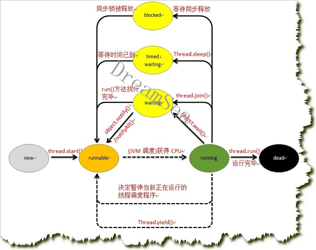

#### 前言
+ 基于API14；

---

#### 概述
1. Thread是并发执行单元，有自己的方法调用栈，参数和局部变量；
2. 有两种方式创建Thread，一种是继承Thread类，重写 `run()` 方法，另外一种是在创建Thread对象时传入一个Runnable对象，这两种方式都需要调用 `start()` 方法；
3. 每个Thread都有优先级，范围是1-10，默认是5，该值决定了获取CPU时间的总量；
4. Thread也可以设置成守护线程，守护线程优先级比较低，只有在不存在非守护线程的时候，守护线程才会退出；

---

#### 状态
+ `NEW` 初始状态，但是还未 `start ` ,并未获得相关资源：
    `Thread t = new Thread();`
+ `RUNNABLE` 就绪状态，还未执行；
    ```
        Thread t = new Thread();
        t.start();
    ```
    或者其他wait/block结束，进入 `RUNNABLE` 状态；
+ `BLOCKED` 阻塞状态，等待监视器锁，等待synchronized块：
    不同线程执行统一监视器锁的时候，如果其中一个线程进入synchronized块（获得对应锁），则应外一个线程进入 `BLOCKED` 状态；
+ `WAITING` 等待状态：
    + 不带超时值的 Object.wait
    + 不带超时值的 Thread.join
    + LockSupport.park
+ `TIMED_WAITTING` 指定特定时间的等待状态：
    + Thread.sleep
    + 带有超时值的 Object.wait
    + 带有超时值的 Thread.join
    + LockSupport.parkNanos
    + LockSupport.parkUntil
+ `TERMINATED` 终止状态；


+ 

---

#### 优先级
+ 线程都有优先级，默认是5，范围是1-10，优先级的高低决定了获得CPU时间的总量；
+ 线程的优先级和创建线程时所在的线程优先级保持一致；

---

#### Daemon
+ 守护线程等到其他非守护线程都结束之后才结束；

---

#### join
+ 在A线程中调用B线程的join方法，A线程进入wait状态，直到B线程之行结束，或者等待指定时间；
+ `public final void join() throws InterruptedException()` ；
+ `public final void join(long millis) throws InterruptedException()` ；
+ `public final void join(long millis, int nanos) throws InterruptedException` ;

---

#### yield
+ 将当前线程让给其他线程（同优先级或者高优先级），进入就绪状态；

---

#### sleep
+ sleep进入wait状态，不涉及监视器锁；

---

#### interrupt
+ 注意只能中断已经处于阻塞的线程；
